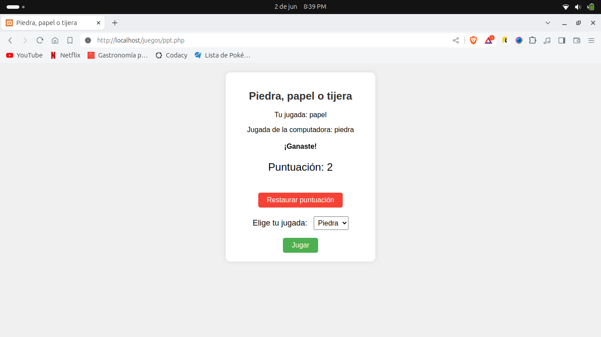

# Piedra, papel o tijera

Juego de Piedra, papel o tijera con PHP.

## Descripción

Este es un juego simple de Piedra, papel o tijera implementado en PHP. El jugador elige una opción (piedra, papel o tijera) y compite contra la computadora.

## Instrucciones de Uso

1. Clona este repositorio o descarga los archivos.
2. Abre el archivo `index.php` en un navegador web.
3. Elige tu jugada haciendo clic en una de las opciones.
4. Observa el resultado y disfruta del juego.

## Requisitos

- PHP instalado en tu servidor local.

## Capturas de Pantalla

## Créditos

- Este juego fue creado utilizando PHP y HTML.
